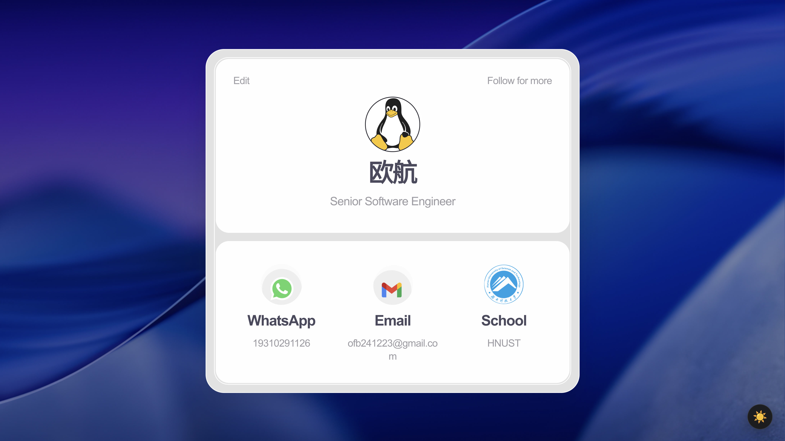
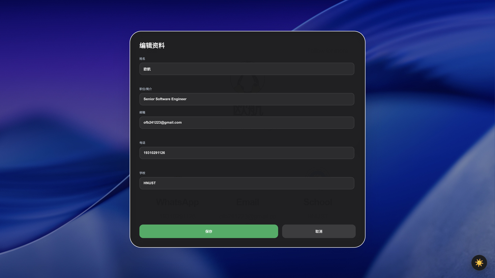
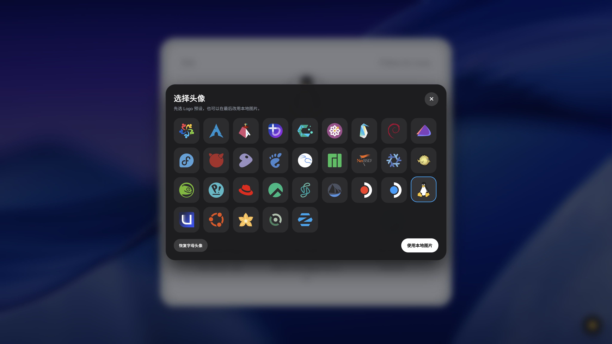
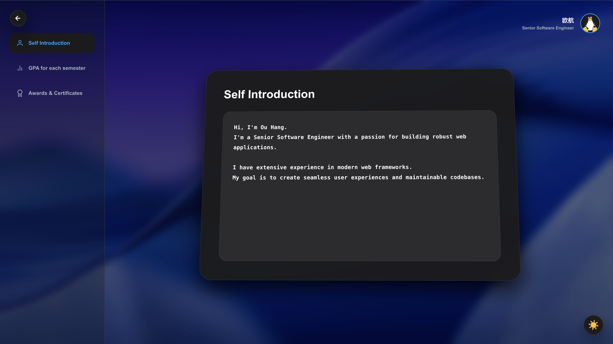
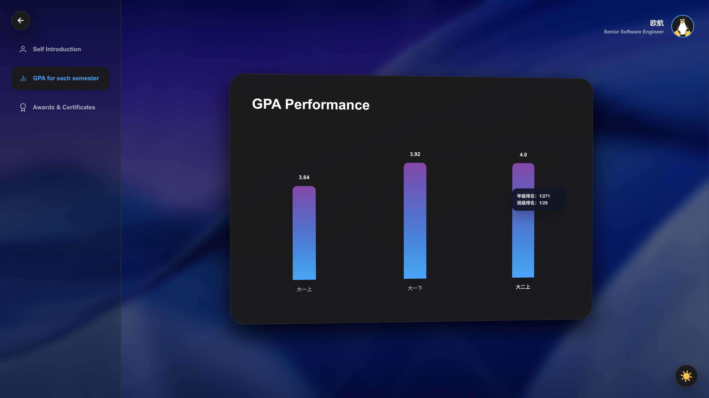
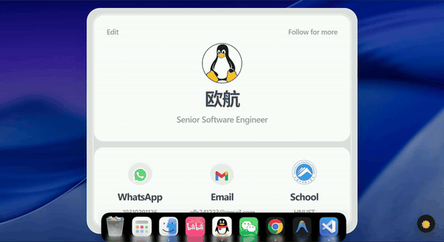
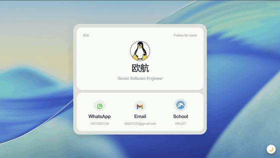
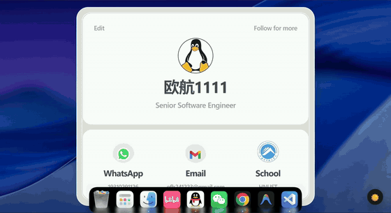
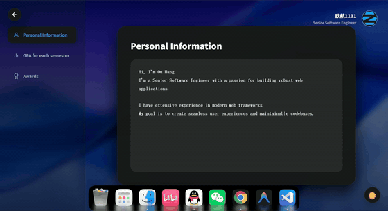

# 高级 Web 课程作业：个人信息卡片页面设计与实现

## 项目简介
本项目基于 `HTML`、`CSS` 和 `JavaScript` 实现了一个可交互的个人信息卡片页面。页面由首页卡片和详情展示页两部分组成，支持资料编辑、头像更换、主题切换、GPA 可视化、奖项展示以及水波纹点击特效，整体目标是在课堂基础作业的基础上，进一步提升页面完成度、交互性与展示效果。

## 效果展示
当前演示素材已放在 `assets/readme/` 目录中，可直接查看：

<table align="center">
  <tr>
    <td align="center"></td>
    <td align="center"></td>
    <td align="center"></td>
  </tr>
  <tr>
    <td align="center"><strong>首页总览</strong></td>
    <td align="center"><strong>编辑信息</strong></td>
    <td align="center"><strong>头像更换</strong></td>
  </tr>
  <tr>
    <td align="center"></td>
    <td align="center"></td>
    <td align="center"></td>
  </tr>
  <tr>
    <td align="center"><strong>自我介绍</strong></td>
    <td align="center"><strong>GPA 模块</strong></td>
    <td align="center"><strong>获奖与证书</strong></td>
  </tr>
</table>

### 其他交互演示
<table align="center">
  <tr>
    <td align="center"></td>
    <td align="center"></td>
    <td align="center"></td>
  </tr>
  <tr>
    <td align="center"><strong>编辑个人信息演示</strong></td>
    <td align="center"><strong>主题切换演示</strong></td>
    <td align="center"><strong>详情页整体演示</strong></td>
  </tr>
  <tr>
    <td align="center"></td>
    <td align="center"></td>
    <td></td>
  </tr>
  <tr>
    <td align="center"><strong>GPA 模块演示</strong></td>
    <td align="center"><strong>Awards 模块演示</strong></td>
    <td></td>
  </tr>
</table>

## 功能实现
- 首页采用卡片式布局，展示姓名、简介、电话、邮箱和学校信息。
- 首页左上角可进入 `Edit` 编辑面板，右上角 `Follow for more` 可进入详情展示页。
- 支持编辑姓名、简介、电话、邮箱和学校信息，并加入姓名、邮箱、手机号表单校验。
- 支持头像预设选择、本地图片上传和恢复字母头像，头像修改结果可同步到首页与详情页。
- 支持深色 / 浅色主题切换，并根据主题切换背景图片。
- 详情页包含 `Self Introduction`、`GPA` 和 `Awards` 三个模块。
- `Self Introduction` 模块加入打字机展示效果，并支持本地持久化。
- `GPA` 模块使用动画柱状图展示学期成绩，鼠标悬停可查看年级 / 班级排名。
- `Awards` 模块支持分页浏览、图片上传、大图弹窗预览和左右切换。
- 页面加入点击水波纹扩散特效，并带有边界反弹效果。

## 创新点
- 参考设计稿重构首页卡片，将基础信息展示改造成更完整的作品展示页面。
- 详情页加入 3D 悬浮跟随效果，增强页面层次感和交互表现。
- 实现全局点击水波纹动画，模拟自然扩散与边界反弹效果。
- 将 GPA 可视化、Awards 弹窗、头像切换等功能整合为完整的信息展示系统。
- 使用 `localStorage` 保存资料、头像、主题、个人介绍和新增奖项，提升页面实用性。

## 技术说明
- `index.html`：负责页面结构、首页卡片布局、详情页模块和弹窗结构。
- `style.css`：负责主题变量、页面布局、动画效果、卡片样式与视觉设计。
- `script.js`：负责资料编辑、表单校验、头像切换、本地存储、GPA 动画、Awards 交互与水波纹特效。

## 项目结构
```text
.
├── index.html             # 页面主体结构，包含首页卡片、编辑面板、详情页和弹窗
├── style.css              # 全站样式文件，负责布局、主题、动画和模块视觉效果
├── script.js              # 页面交互逻辑，负责编辑、校验、本地存储、图表和特效
├── README.md              # 项目说明文档，用于展示功能、效果和运行方式
└── assets/
    ├── avatar-presets/    # 头像预设资源，供头像选择弹窗使用
    ├── awards/            # 奖项图片资源，供 Awards 模块分页展示和预览
    ├── background/        # 明暗主题背景图片资源
    ├── contact-icons/     # 首页联系方式图标资源
    └── readme/            # README 展示用截图和演示视频资源
```

## 总结
本项目在完成课堂基础要求的基础上，进一步补充了视觉设计、动态交互和信息展示功能，较完整地体现了对前端页面结构、样式设计、动画实现、数据持久化和 JavaScript 交互逻辑的综合运用。
